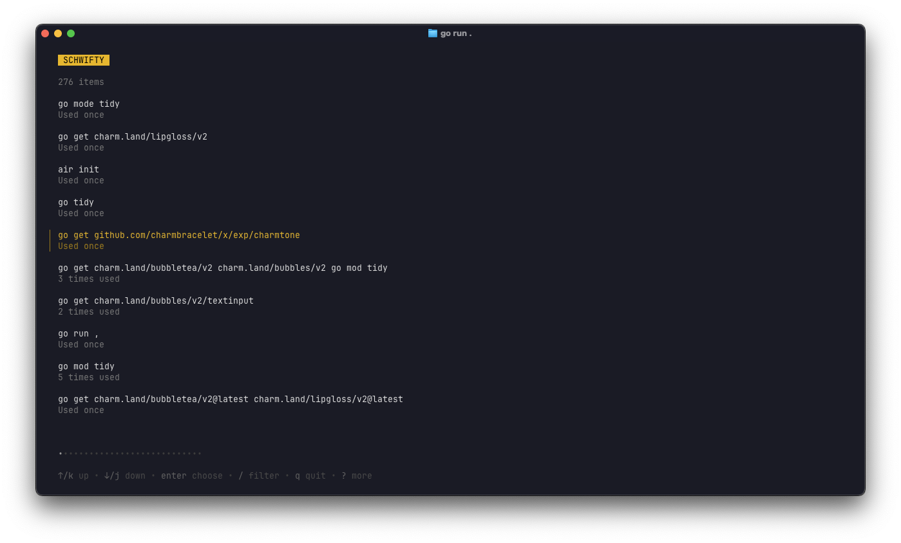

# SCHWIFTY

**SHWIFTY** is a command-line interface (CLI) application designed to enhance shell experience by providing an efficient way to search through your command history. It allows users to quickly find and reuse previously executed commands, improving productivity and workflow in terminal environments.

## Motivation

I found myself frequently needing to search through my shell history to find commands I had previously executed - pressing the up arrow key multiple times to find a command I had used before. Using SCHWIFTY, I can easily navigate through my command history, search for specific commands, and execute them without having to remember the exact syntax or location in the history.

There are probably other tools that do the same, but I wanted to create a tool in Go that was simple, fast, and fit my workflow. I also wanted to learn more about Go and the Bubble Tea framework, which is used to build terminal user interfaces.

## Name

The name **SCHWIFTY** is a playful nod to the popular phrase from the animated series *Rick and Morty*, where *Get Schwifty* is a memorable line. In this context, **SCHWIFTY** stands for **S**earch **C**ommand **H**istory **W**ith **I**ntelligent **F**iltering **T**ools for **Y**ou, emphasizing the application's purpose of providing an intelligent and efficient way to search through command history.

## Installation

To install SCHWIFTY, you can use the following methods:

### From Source

1. Clone the repository:
   ```bash
   git clone https://github.com/vanesterik/schwifty.git
   cd schwifty
   ```

2. Build the application:
   ```bash
   go build -o bin/schwifty .
   ```

3. Move the binary to a directory in your PATH:
   ```bash
   mv bin/schwifty /usr/local/bin/
   ```

### Using Go Install

If you have Go installed, you can use `go install`:
```bash
go install github.com/vanesterik/schwifty@latest
```

This will install the `schwifty` binary in your Go bin directory. Make sure this directory is in your PATH.

## Usage

To use SCHWIFTY, simply run the `schwifty` command in your terminal. You can then search through your command history and select commands to execute or copy.



## License

This project is licensed under the MIT License - see the [LICENSE](LICENSE) file for details.

## Acknowledgements

- [Rick and Morty](https://rickandmorty.fandom.com/wiki/Get_Schwifty_(episode)) for the inspiration behind the name.
- [Bubble Tea](https://github.com/charmbracelet/bubbletea) for the TUI framework used in this project.